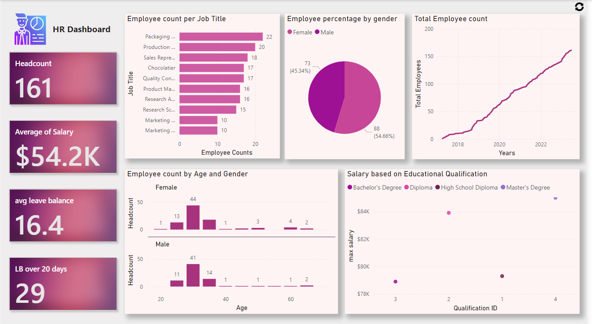

# HR_Data_Analytics_PowerBI_Dashboard
## Overview
This project showcases the analysis of Human Resources (HR) data and the creation of interactive dashboards using Power BI. It covers the process of loading and cleaning data, creating insightful metrics, and designing a comprehensive HR dashboard to visualize key HR statistics effectively.

## Things done in this project:

- Loading and Cleaning Data: Import data into Power BI and use Power Query to clean and prepare it.
- Creating HR Metrics: Calculate essential HR metrics such as headcount, average leave balance, and average salary using Power Pivot.
- Data Enrichment: Add meaningful columns to the data, such as Employee's first name and age group.
- Salary Analysis: Explore relationships between salary and educational qualifications.
- Visual Filters: Apply filters to view top and bottom paid staff within each job role.
- Customizing Visuals: Modify visual elements in Power BI, including colors, axes, labels, and legends.
- Advanced DAX Calculations: Perform advanced calculations like cumulative headcount and leave balances exceeding 20 days.
- Dashboard Design: Create a detailed monthly HR dashboard with Power BI.
- Using Card Visuals: Work with the "NEW" card visual to highlight specific metrics.

## The project addresses the following analysis themes:

- Job Count Analysis: Determine how many people are employed in each job role.
- Gender Breakdown: Analyze the gender distribution among the staff.
- Age Distribution: Examine the age spread of the employees.
- Salary Analysis: Identify which job roles have higher salaries.
- Top Earners: Find the top earners within each job role.
- Qualification vs. Salary: Explore the correlation between educational qualifications and salary.
- Staff Growth Trend: Analyze the trend of staff growth over time.
- Employee Filter: Filter employees based on the starting letter of their name.
- Leave Balance Analysis: Review leave balances, especially focusing on those exceeding 20 days.
- HR Dashboard: Design a HR dashboard to consolidate and visualize key metrics.

## Insights
### 1. Employee Statistics
#### Total Number of Employees Over Time:
- 2017: 1 employee
- 2023: 161 employees
- Growth: Significant increase in the number of employees from 1 in 2017 to 161 in 2023.

#### Gender Distribution:
- Total Male Employees: 73
- Total Female Employees: 88
- Total Employees: 161
- Gender Ratio: More females than males in the workforce.

### 2. Employee Roles and Distribution:
#### Highest Number of Employees by Role:
- Packaging Associate: 22 employees
*Note: This role has the more number of employees compared to others.*
#### Lowest Number of Employees by Role:
- Marketing Manager: 10 employees
- Marketing Specialist: 10 employees
*Note: These roles have the less number of employees.*
### 3. Age Distribution:
#### Female Employees Aged 30:
- Number of Employees: 44
- Significance: This is the highest number of female employees in a single age group.
#### Male Employees Aged 30:
- Number of Employees: 41
- Significance: This is the highest number of male employees in a single age group.
### 4. Salary Information:
#### Overall Salary Metrics:
- Average Salary: $54,231
- Minimum Salary: $28,900
- Maximum Salary: $85,000
#### Role-Specific Salary Details:
- Highest Average Salary: Product Manager - $82,825
- Lowest Average Salary: Packaging Associate - $33,409
- Highest Maximum Salary: Product Manager - $85,000
- Lowest Minimum Salary: Packaging Associate - $28,900

#### Educational Qualification and Salary:
- Highest Salary (Masters Degree): $85,000
- Lowest Maximum Salary (Bachelor's Degree): $78,900
### 5. Leave Balance Information:
- Average Leave Balance: 16.4 days
- Number of Employees with Leave Balance Greater Than 20 Days: 29
- Significance: Indicates that a portion of the workforce has a significant leave balance.
## Visualizations
#### The dashboard includes the following visualizations:

- Employee count per job title: Bar Chart 
- Employee percentage by gender: Pie Chart
- Employee count per year: Line Chart
- Employee count by age and gender: Coloumn Chart
- Maximum Salary Based on Educational Qualification: Scatter Chart 
- Headcount, Average Salary, Average Leave Balance and Leave Balance more than 20 days: Card  

## Dashboard Overview

You can download and view the project demonstration video by [clicking here](https://github.com/NikithaMogaveer/HR_Data_Analytics_PowerBI_Dashboard/releases/download/hr-dashboard-demo-video-v1/HR_clip.mp4)

## Conclution
The workforce has grown significantly from 2017 to 2023, reflecting the company’s expansion. There is a higher number of female employees compared to males, with notable role variations, Packaging Associates being the largest group and Marketing roles the smallest. Employees aged 30 are the largest age group for both genders. Salary analysis shows that Product Managers earn the highest salaries, while Packaging Associates receive the lowest. Educational qualifications affect salary levels, with Master’s degree holders earning the most. Leave balances are generally moderate, with some employees having more than 20 days of leave. These insights highlight growth, gender imbalance, role distribution, salary disparities, and leave management within the organization.
